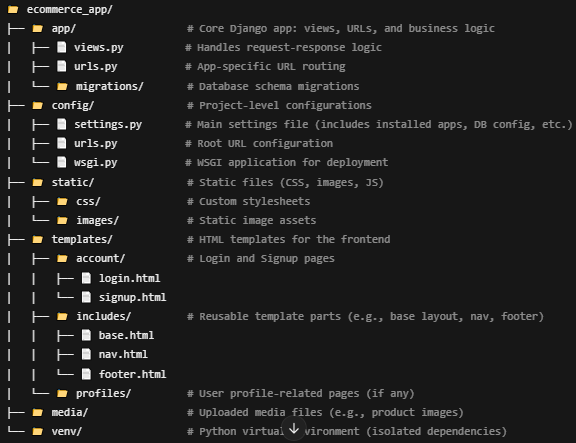
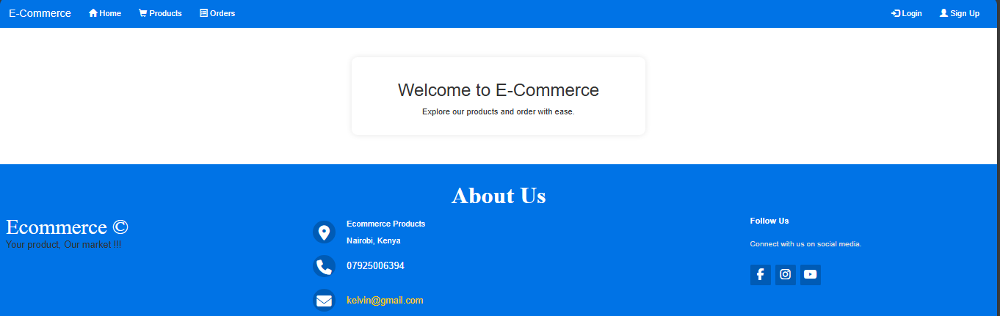
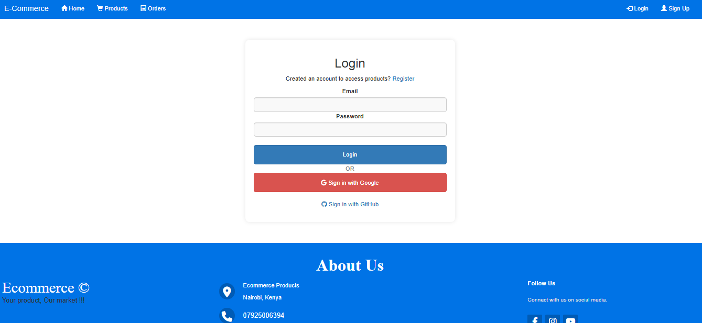
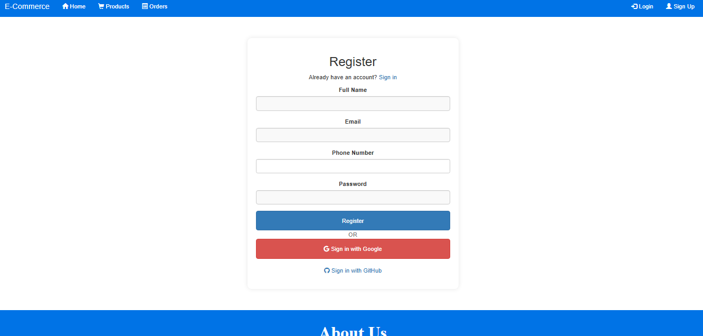

# Ecommerce APP
A Django-based demo frontend web application designed to showcase key features of an eCommerce system. It interacts with a backend eCommerce API to demonstrate core functionalities such as customer management, order processing, and user authentication using OAuth2. The app follows a modular structure to simulate integration with multiple service endpoints and highlight scalability potential in a real-world setup.

## Project Structure

## Prerequisites
• Python 3.x 
• Pip 
• PostgreSQL or any compatible database 
• [Google Account](https://console.cloud.google.com/getting-started)   
• [Africa Talk SMS gateway](https://account.africastalking.com/apps/sandbox)  

## Setup Instructions
1. Clone the Repository:  git clone https://github.com/kevi-t/Ecommerce_API 
2. Set Up Virtual Environment: python -m venv venv
3. To activate the environment: source venv/bin/activate & On Windows use `venv\Scripts\activate`
4. Install Dependencies: pip install -r requirements.txt
5. Configure local settings add your secret keys for the Google account,Django secret and Africa Talk Sms gate way
6. Configure Environment Variables: Create a .env file in the root directory and add necessary environment variables; Google,AfricaTalking SECRET_KEY,DATABASE_URL
8. Run Migrations:  python manage.py migrate
9. Run the Development Server:  python manage.py runserver

### Key Features in This `README.md`:
1. **Project Structure**: Clearly outlined, showing how the project is divided into modules.
2. **Setup Instructions**: Step-by-step guide to get the API up and running locally.
3. **API Endpoints**: Sample endpoints for the main modules (customer, order).

### Web Application Screenshots
Landing page

Login Page

Signup Page

### Process flow Diagram

