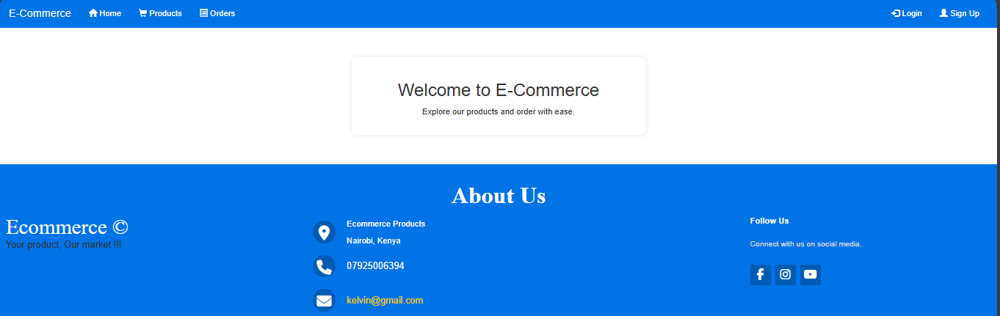
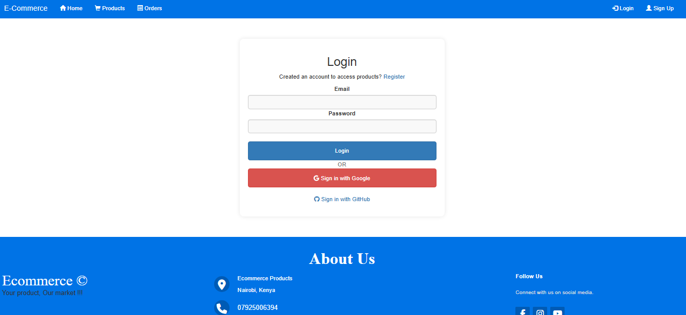
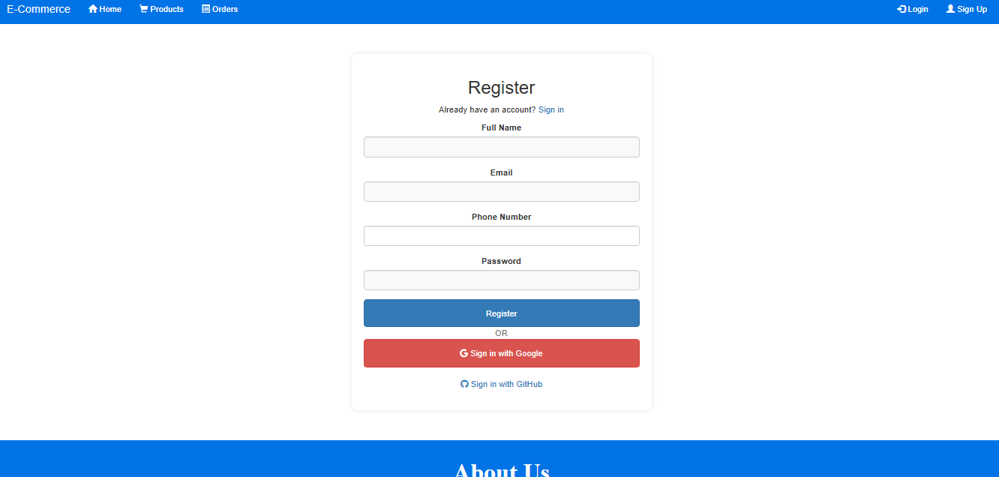

# Ecommerce App

An Angular 17 single-page application (SPA) that serves as the frontend for the Ecommerce service. It handles customer registration, login (including Google OAuth), product browsing, profile management, and order placement.

## Technologies

- [Angular 17](https://angular.io/) — standalone components, no NgModules
- [TypeScript 5.2](https://www.typescriptlang.org/)
- SCSS for component and global styling
- JWT-based authentication via HTTP interceptor

## Prerequisites

- [Node.js 18+](https://nodejs.org/)
- [npm](https://www.npmjs.com/)
- Running [ecommerce-service](../ecommerce-service/) API backend

## Setup

```bash
git clone https://github.com/kevi-t/ecommerce_app
cd ecommerce_app
npm install
```

Set the API base URL in `src/environments/environment.ts` to point at your backend instance.

## Development

```bash
npm start        # ng serve → http://localhost:4200
npm run build    # Production build → dist/ecommerce-app/browser/
npm test         # Karma/Jasmine unit tests
```

## Project Structure

```
src/app/
├── core/
│   ├── guards/         # Route protection (auth.guard.ts)
│   ├── interceptors/   # JWT injection on outgoing requests (auth.interceptor.ts)
│   ├── models/         # TypeScript interfaces
│   └── services/       # API services: auth, order, profile
├── features/
│   ├── auth/           # Login and registration pages
│   ├── home/           # Landing page
│   ├── products/       # Product listing
│   ├── orders/         # Order history
│   ├── profile/        # Profile view, edit, and settings
│   └── errors/         # 404 and 500 error pages
└── shared/
    └── components/     # Navbar, Footer (shared across features)
```

## Authentication Flow

1. `AuthService` handles login/register API calls and stores the JWT in local storage.
2. `AuthInterceptor` attaches `Authorization: Bearer <token>` to every outgoing HTTP request.
3. `AuthGuard` protects routes — unauthenticated users are redirected to `/login`.

## Screenshots

Landing page


Login page


Signup page


### Process Flow Diagram


## Deployment

- [Vercel](https://vercel.com/) — automatic deploy on push; build output: `dist/ecommerce-app/browser/`
